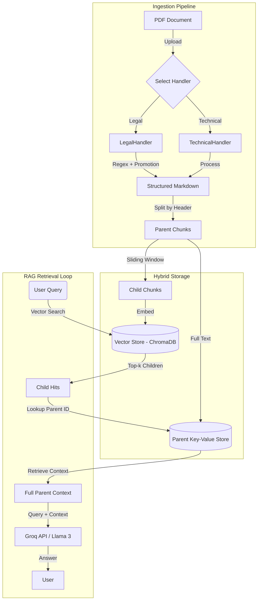

# RAG Chatbot: Multi-Modal AI Assistant

A professional Retrieval-Augmented Generation (RAG) system specialized for **Legal Contracts**, **Technical Manuals** and **Financial Documents**. This project features a **Parent-Child Indexing Architecture** for superior context retrieval and integrates **Groq** for high-speed inference. 
We have made use of both Ollama and Groq in order to achieve the best possible results and benchmark results.


---

## Table of Contents
- [System Architecture](#-system-architecture)
- [Key Features](#-key-features)
- [Directory Structure](#-directory-structure)
- [Installation](#-installation)
- [Usage](#-usage)
  - [Running the Groq Legal Assistant](#running-the-groq-legal-assistant)
  - [Running the API Server](#running-the-api-server)

---

## System Architecture

This system uses a **"Small-to-Big"** retrieval strategy. We index small "Child" chunks for precise vector search but retrieve the full "Parent" chunk (e.g., an entire Legal Article) to provide the LLM with complete context.


## The directory structure:
- Currently there exists an extra file termed as run_legal.py which is solely for testing purposes, further versions will integrate the code into the legal.py folder.
- This seperation has primarily been done, due to different LLM models being used for retrieval by Technocrat dev and myself.
  
```bash
RAG_CHATBOT/
├── data/                   # Place your PDFs here (e.g., sampledata.pdf)
├── chroma_db/              # Vector database persistence directory
├── handlers/               # Document processors
│   ├── base.py             # Abstract base class
│   ├── legal.py            # Logic for Contracts/Agreements 
│   └── technical.py        # Logic for Manuals 
├── database.py             # VectorDB class (Parent-Child Logic) 
├── config.py               # Global configurations
├── main.py                 # FastAPI Backend Server [cite: 276]
└── run_legal.py             # Main Entry Point for legal docs,{Aarya's commit} (Groq Integration)
```

## Installation
- Clone the repository:
  ```bash
  git clone [https://github.com/your-username/rag-chatbot.git](https://github.com/your-username/rag-chatbot.git)
  cd rag-chatbot
  ```
- Install Dependencies:
  ```bash
  pip install fastapi uvicorn groq chromadb sentence-transformers pymupdf4llm langchain-text-splitters python-dotenv
  ```
- Setup Environment: Create a .env file in the root directory (make sure to have Ollama running for Technocrat Dev's version):
   ```bash
  GROQ_API_KEY=gsk_your_actual_api_key_here 
  ```

## Usage
- For the Groq Legal Assistant
- You can get it up, directly using this:
  ```bash
  python run_groq.py
  ```
 - Running the API Server
 - To start the backend server for the frontend application (Technocrats repo):

   ```bash
    uvicorn main:app --reload
   ```  
